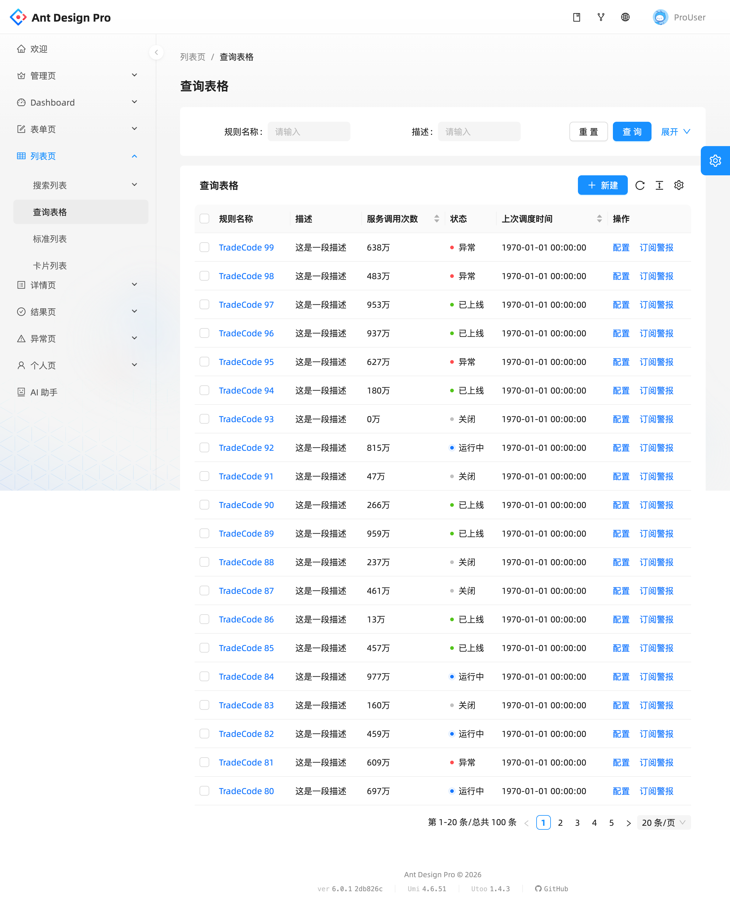
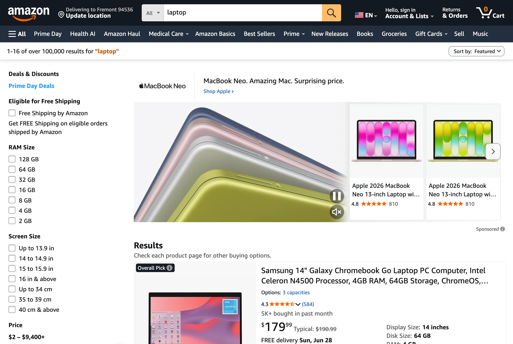
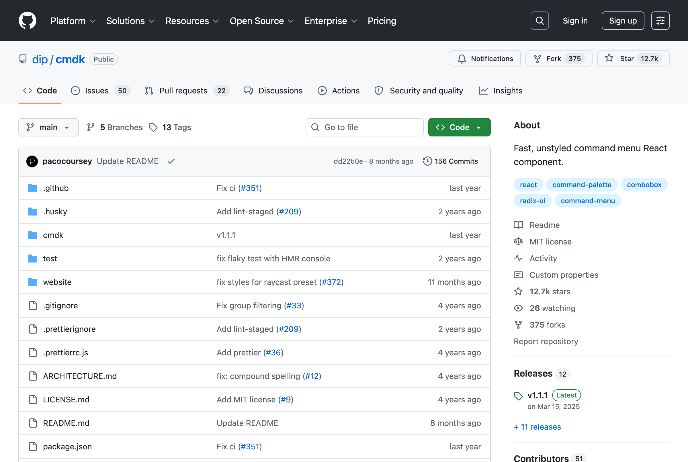
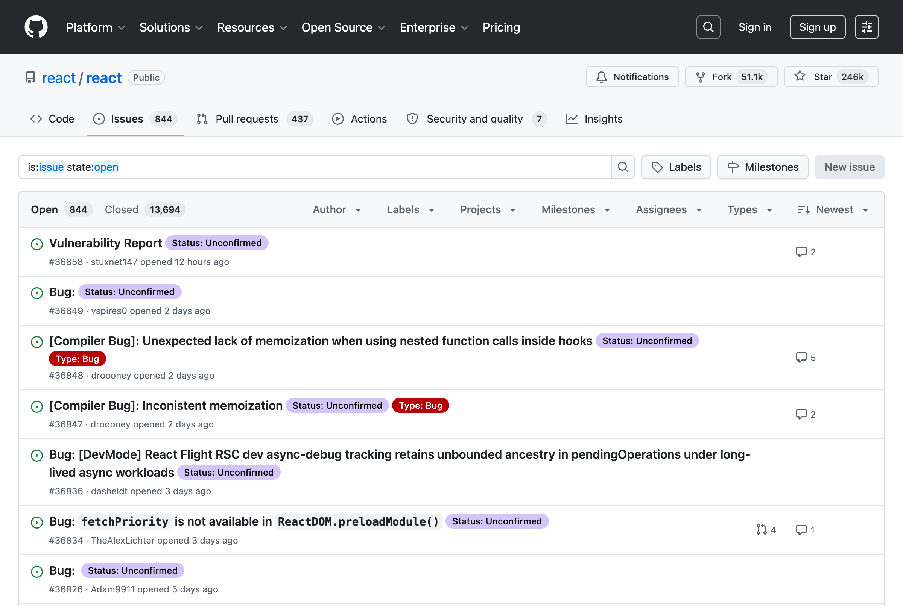
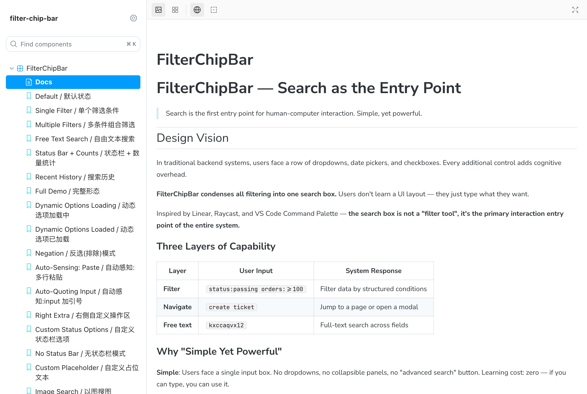

# 一个搜索框的思考

> 你每天打开十个后台系统，面对十个不同的搜索区域。每个区域有下拉框、日期选择器、复选框、标签切换。你点击、选择、再点击、再选择。
>
> 有一天，我在想：能不能像 Google 一样，只给一个框？

---

## 问题在哪

后台筛选有两套方案，各有短板。

**下拉框**精确但笨重——想组合查询？想排除某个值？想纯键盘操作？得点七八次。

**搜索框**方便但模糊——搜 `iPhone 15` 可能匹配到产品名，也可能匹配到描述里的一句话。没法精确表达"我要状态是通过的、订单量大于 100 的"。

常规做法是两个都放。结果页面越来越长，用户得在搜索框和一堆筛选器之间来回切换。

我想试试：能不能把两者合并到一个输入框里。

---

## 基本思路

```
审核状态:通过 -部门:运营一部 订单量:>=100 kxccaqvx12
```

一行文字，混合了结构化筛选、排除、数值比较和自由文本。思路是：**用户怎么想，就怎么打**，parser 负责把文本拆解成结构化的筛选条件。

同时也支持前缀语法：

- `#urgent` — 给内容打标签
- `@Robin` — 指定某个用户
- `/docs` — 触发命令（跳转到文档、复制安装命令等）

不同的前缀对应不同的字段，一个输入框里可以混用。

---

## 实践中踩的坑

做出来之后，发现真实场景比想象中复杂。

### 级联选项

部门 → 团队 → 项目，三个字段之间有依赖关系。选了工程部，团队列表应该只剩工程组的团队。

解决办法是把 `options` 从静态数组改成 `async (chips) => fetchTeams(chips['部门'])`。这样选项不是固定的，而是根据用户已选条件动态计算的。

### 缩写

`审核状态:通过` 有 8 个字符，但实际信息量很小。经常用的字段，打全称太累。

加了 `aliases` 配置：`st:pass` 等价于 `审核状态:通过`。和 Unix 命令用缩写（`ls` 而非 `list`）是同一个思路——在打字速度有限的情况下，减少击键次数。

### 打错字怎么办

用户把 `Passing` 打成了 `Pasing`。传统做法是标红，让用户自己发现。

这里参考了通信工程里的前向纠错（FEC）。用 Levenshtein 编辑距离找到最近的合法选项，在下拉框里提示 "Did you mean **Passing**?"。用户一键纠正，不用删掉重打。

据统计，92% 的打字错误是单字符错误，距离设为 2 基本能覆盖。

### 大小写

用户输入 `status:passing` 而不是 `Status:Passing`，不应该报错。全链路做了大小写不敏感处理——输入和选项匹配时统一 `toLowerCase`，输出还是用规范的 label 和 value。

---

## 怎么让新手上手

组件功能不少：别名、前缀、预设、快捷键。但新手第一次用，不可能也不应该全学会。

全教——信息过载，直接劝退。
不教——功能藏太深，永远没人发现。

最后参考了维果茨基的最近发展区（ZPD）：在用户用到一定次数后，适时弹出一条提示。

```
第 3 次使用 → 💡 输入 字段:值 来按字段筛选
第 8 次使用 → 💡 st:pass 是简写
第 15 次使用 → 💡 按 / 快速聚焦搜索框
第 25 次使用 → 💡 点 ⭐ 保存常用搜索
```

每条只出现一次，不打断当前操作。用户在使用中自然学会，而不是看教程。

---

## 几个调过的参数

有两个时间参数花了一些时间调：

- **150ms**：输入框失焦后关闭下拉框的延迟。太短用户来不及点建议项，太长下拉框关不掉
- **200ms**：级联选项重新加载的防抖。用户连续输入多个条件时，只发最后一次请求，不每次都打 API

人类对视觉延迟的感知阈值大约在 200ms 左右——低于它感受不到等待，高于 500ms 就会觉得卡。

---

## 各种筛选方案的分析

做之前调研了一圈现有的筛选交互方案，各有适用场景。

### 方案一：表单式筛选（下拉框 + 日期选择器 + 复选框）

最传统的做法，几乎每个后台都在用。比如 Ant Design Pro 的 QueryFilter：



**优点**：直观，新手零学习成本，每个控件的含义一目了然。

**缺点**：

- 占用大量垂直空间，条件越多页面越长
- 组合查询不方便——想表达"状态是通过 且 订单量大于 100 且 排除A部门"，得点七八次
- 键盘操作几乎不可能
- 扩展新筛选条件 = 改 UI 布局 + 加控件

**适用场景**：筛选条件少（≤5 个）、用户群体广、操作频率低。

### 方案二：纯全文搜索

一个搜索框，后端做模糊匹配。


**优点**：UI 极简，开发成本低。

**缺点**：

- 搜不到结构——`iPhone 15` 可能匹配产品名，也可能匹配到描述里的某句话
- 无法精确表达"状态 = 通过 且 订单量 ≥ 100"
- 筛选结果不可预测，用户不知道搜了哪些字段

**适用场景**：内容搜索（文章、商品），不适合结构化数据筛选。

### 方案三：Faceted Search（分面筛选）

电商常见的模式：左侧搜索框 + 右侧分面导航。



**优点**：搜索和筛选共存，分面统计（"品牌A 有 23 件"）帮助用户决策。

**缺点**：

- 分面依赖后端聚合查询，实现成本高
- 布局固定（左侧列表 + 右侧筛选），不适合所有页面
- 移动端适配困难

**适用场景**：电商、内容平台。后台管理系统不太合适。

### 方案四：命令面板（⌘K 弹窗）

Linear、Raycast、shadcn/ui 的 [cmdk](https://cmdk.paco.me/) 用的模式。



**优点**：键盘友好，模糊匹配，可以跳转 + 执行操作。

**缺点**：

- 是弹窗，不常驻页面——每次要按 ⌘K 打开
- 擅长"跳转"和"执行命令"，不擅长"精确筛选"
- 没有结构化语法（不能表达 `状态:通过 订单量:>=100`）

**适用场景**：全局导航、快捷操作。和筛选是互补关系，不是替代。

### 方案五：结构化查询语法（GitHub / Gmail 风格）

GitHub Issues 和 Gmail 用的模式：搜索框支持 `key:value` 语法。



**优点**：表达力强，一行文字可以表达复杂查询，键盘友好。

**缺点**：

- 学习成本高——用户得记住字段名和语法规则
- 没有即时反馈——输入错了不一定知道
- 通常没有建议和自动补全

**适用场景**：开发者工具、高频用户。

### 方案六：FilterChipBar（本项目的方案）

试图结合方案一（直观）、方案四（键盘友好）和方案五（表达力），同时解决各自的缺点：



| 特性     | 表单式     | 全文搜索 | Faceted  | 命令面板 | GitHub 语法 | FilterChipBar |
| -------- | ---------- | -------- | -------- | -------- | ----------- | ------------- |
| 表达力   | 低         | 低       | 中       | 低       | 高          | 高            |
| 学习成本 | 零         | 零       | 低       | 低       | 高          | 渐进          |
| 键盘操作 | 差         | 一般     | 差       | 好       | 好          | 好            |
| 空间占用 | 大         | 小       | 大       | 零(弹窗) | 小          | 小            |
| 即时反馈 | 有         | 无       | 有       | 有       | 无          | 有            |
| 自动补全 | 有(下拉)   | 无       | 有(分面) | 有       | 无          | 有            |
| 错误纠正 | N/A        | 无       | N/A      | 无       | 无          | 有(FEC)       |
| 扩展成本 | 高(加控件) | 低       | 高       | 中       | 低          | 低(加配置)    |

核心区别：**FilterChipBar 有自动补全和语法高亮**。用户不需要记住语法——输入 `S` 就看到 `Status:` 的建议，点击即可。打错了会提示 "Did you mean Passing?"。这降低了方案五的学习门槛，同时保留了它的表达力。

它不是替代方案一到四，而是**在需要精确筛选的场景下，提供一个比表单更紧凑、比纯语法更友好的选择**。

---

- **数据密集型后台**：SKU 管理、订单列表、审核系统——筛选条件多、组合复杂
- **需要 power user 体验的产品**：键盘党、高频操作用户会喜欢 `st:pass` 这种短码
- **多 UI 框架共存的项目**：headless hook 和 renderer 分离，antd / shadcn / 自定义都能接

和 [cmdk](https://cmdk.paco.me/) 的区别：cmdk 是命令面板（⌘K 弹窗），filter-chip-bar 是内联搜索栏（页面常驻）。cmdk 解决"快速跳转"，filter-chip-bar 解决"精确筛选"。两者可以共存。

---

## 架构

组件分三层：

```
useFilterChipBar()    ← headless hook（纯逻辑，零 UI 依赖）
FilterChipBar         ← shadcn renderer（Radix + Tailwind，默认导出）
FilterChipBarAntd6    ← antd6 adapter（named export）
```

用 antd 的项目引 adapter，用 Tailwind + Radix 的项目用默认 renderer，想自己写也行——hook 返回所有状态和事件处理函数，renderer 只管画 UI。

---

## 开源

```bash
npm install filter-chip-bar
```

```typescript
import { FilterChipBar } from 'filter-chip-bar';

<FilterChipBar
  chipConfigs={[...]}
  storageNamespace="my-page"
  onFiltersChange={(result) => { ... }}
/>
```

- **GitHub**: [https://github.com/675076143/filter-chip-bar](https://github.com/675076143/filter-chip-bar)
- **npm**: [https://www.npmjs.com/package/filter-chip-bar](https://www.npmjs.com/package/filter-chip-bar)
- **在线体验**: [https://filter-chip-bar.vercel.app](https://filter-chip-bar.vercel.app)
- **Storybook 文档**: [https://filter-chip-bar-storybook.vercel.app](https://filter-chip-bar-storybook.vercel.app)

48 个单元测试，中英双语文档，CI/CD 自动发版。

---

## 写在最后

回到最初的问题：能不能像 Google 一样，只给一个框？

试了试，可以做。过程中学了一些东西，也踩了一些坑，记录下来，也许对遇到类似问题的人有帮助。

如果有兴趣试试，打开 [在线 demo](https://filter-chip-bar.vercel.app) 直接体验，不用装任何东西。

---

_filter-chip-bar · MIT License · React + Radix UI + Tailwind CSS_
